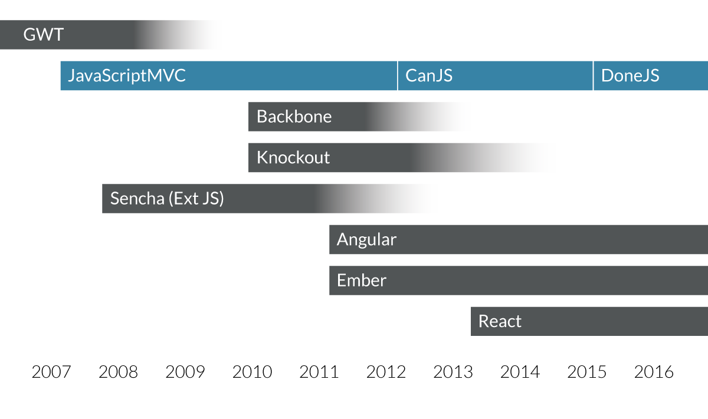
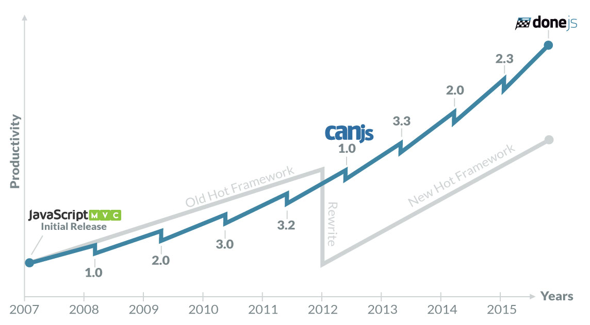
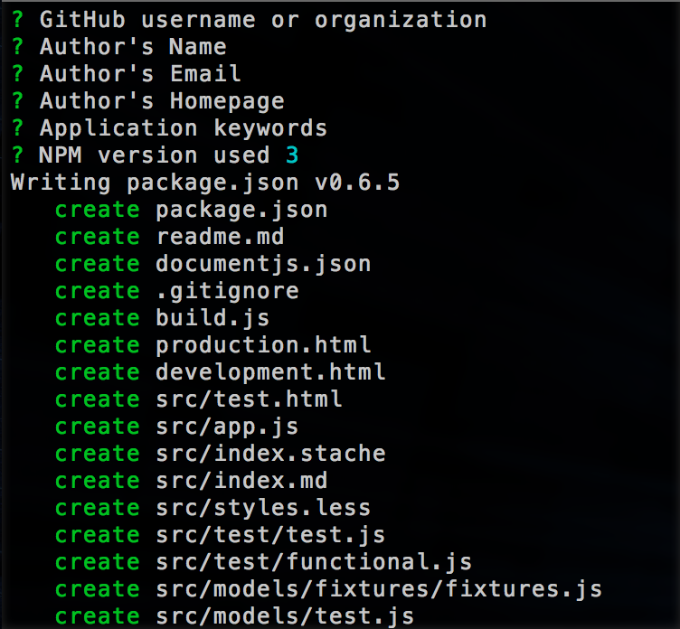
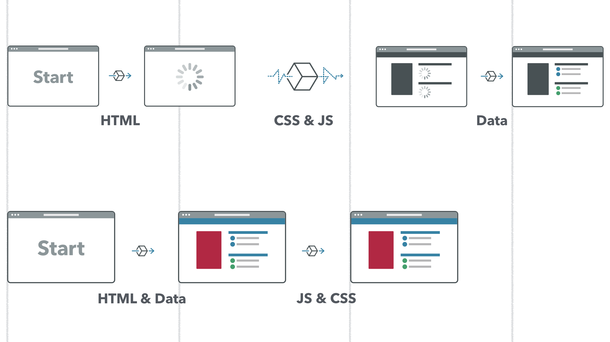

title: DoneJS - Your app. Done.
output: index.html
theme: theme
controls: false
logo: theme/logo.png
style: style.css

-- centered hero

# DenverScript, February 23, 2016

-- color dark-grey hero centered
<h1 style="font-size: 4em">🔥🔥🔥🔥🔥🔥🔥🔥🔥🔥🔥🔥🔥😭🔥🔥🔥🔥🔥🔥🔥🔥🔥🔥🔥🔥🔥🔥🔥🔥🔥🔥🔥🔥🔥🔥🔥🔥🔥🔥🔥🔥🔥🔥🔥🔥🔥🔥🔥🔥🔥🔥🔥🔥🔥🔥🔥🔥🔥🔥🔥🔥🔥🔥🔥🔥🔥🔥🔥🔥🔥🔥🔥🔥🔥🔥🔥🔥🔥🔥🔥🔥🔥🔥🔥🔥🔥🔥🔥🔥</h1>

-- color dark-grey hero centered

<h1>Performance</h1>
<h1>Maintainability</h1>
<h1>Usability</h1>

-- color light-grey hero

## <small>Better</small> Performance

- _Server Side Rendered (Isomorphic)_
- Progressive Loading
- Minimal Data Requests
- Minimal DOM Updates
- Worker Thread Rendering
- Deploy to a CDN

-- color blue hero

## <small>More</small> Maintainable

- Comprehensive Testing
- Documentation
- Continuous Integration & Deployment
- _NPM Packages_
- ES6 Modules
- Modlets
- Custom HTML Elements
- MVVM Architecture
- _Hot Module Swapping_
- Generators

-- color dark-grey hero

## <small>Improved App</small> Usability

- _Real Time_
- Two-way Routing
- IE8+
- _iOS, Android_
- _Desktop_

-- centered

## With a History

-- centered

## Why is History Important?

<small>Source: <em>[Longevity (or Lack Thereof) in JavaScript Frameworks](http://blog.bitovi.com/longevity-or-lack-thereof-in-javascript-frameworks/)</em></small>

-- hero color blue wide-list

## How Do We Do It?

- It's our business model
 - Building amazing applications for our clients  using our tools!
- Enterprise Clients
 - Want long term stability and reliability
- Hard work and persistence

-- color light-grey hero wide-list

## What's in the box...

- Open Source JavaScript framework (MIT)
- Backend services agnostic
- Windows, Linux, OSX
- Comes with
  - [StealJS](http://stealjs.com) - ES6, CJS, and AMD module loader and builder
  - [CanJS](http://canjs.com) - Custom elements and Model-View-ViewModel utilities
  - [jQuery](http://jquery.com) - DOM helpers
  - [FuncUnit](http://funcunit.com) - Functional tests
  - [Testee](https://github.com/bitovi/testee) - QUnit, Mocha and Jasmine Test runner
  - [DocumentJS](http://documentjs.com) - Documentation
  - [can-ssr](http://github.com/canjs/ssr) - Server-Side Rendering Utilities for CanJS
  - [can-connect](https://github.com/canjs/can-connect) - Assemble real-time, high performance, restful data connections.

--

## Getting Started

> npm install donejs -g

> donejs init MY-AMAZING-APPLICATION

## Other things...

> donejs develop

> donejs test

> donejs build

> donejs deploy

-- centered

## Server Side Rendering

-- centered color hero blue

  <h1>Progressively Loading Optimized Bundles</h1>

-- centered

## Content Delivery Networks

-- centered

## Content Delivery Networks

-- color hero light-grey

## Desktop and Mobile Builds

#### iOS/Android (Cordova)

> donejs add cordova

> donejs build cordova

#### Desktop (nw.js)

> donejs add nw

> donejs build nw

-- hero color blue centered
## Learn More

<iframe width="560" height="315" src="https://www.youtube.com/embed/24U0kvpMVWQ" frameborder="0" allowfullscreen></iframe>

[High Performance Apps with DoneJS](https://youtu.be/24U0kvpMVWQ)

-- hero color light-grey

# DoneJS Training!
## julia at bitovi.com

-- presenter hero color dark-grey wide-list
## The End.

<h2>DoneJS</h2>
<ul>
  <li>[<i class="fa fa-github"></i> donejs](https://github.com/donejs/donejs)</li>
  <li>[<i class="fa fa-twitter"></i> @donejs](http://twitter.com/donejs)</li>
</ul>
<ul>
  <li>[<i class="fa fa-comment"></i> gitter.im/donejs/donejs](https://gitter.im/donejs/donejs)</li>
</ul>

<h2>Julia Allyce</h2>
<ul>
  <li>[<i class="fa fa-github"></i> julia-allyce](https://github.com/julia-allyce)</li>
  <li>[<i class="fa fa-twitter"></i> @julia_allyce](http://twitter.com/julia_allyce)</li>
</ul>

<h2 style="margin-top: 1em; clear:both">[http://julia-allyce.github.io/denverscript-donejs/](http://julia-allyce.github.io/denverscript-donejs/)</h2>
